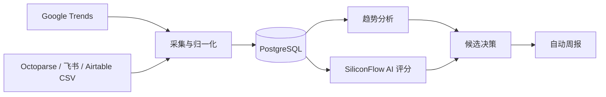

# TrendPilot 亚马逊选品情报工作台

TrendPilot 是供内部选品团队使用的 Web 工作台，覆盖数据采集、趋势分析、AI
评分和决策周报四个阶段。当前版本已经部署到阿里云 ECS，并使用 PostgreSQL
持久化数据。

> 状态快照：2026-09-15。当前为内部试用版，不建议在没有 HTTPS、访问控制和
> 监控告警的情况下开放给不受信任的公网用户。

## 当前状态

| 项目 | 状态 | 说明 |
| --- | --- | --- |
| Web 应用 | 已上线 | Next.js 16，Docker 容器运行于 ECS |
| 数据库 | 已上线 | PostgreSQL 16，数据库端口不对公网暴露 |
| 候选产品 | 已入库 | 189 条、37 个已有分类；覆盖全部 36 个标准类目 |
| 真实 Listing | 待接入 | 当前没有带 ASIN 的真实商品记录 |
| Google Trends | 已自动化 | 每天 09:00 采集美国站公开趋势 |
| 商品 CSV Feed | 已完成、待配置 | 每 6 小时检查；配置数据源地址后自动导入 |
| AI 评分 | 已上线 | SiliconFlow 已配置，支持五维评分与卖点提炼 |
| 用户登录 | 已上线 | 环境管理员 + 数据库内部成员，8 小时会话 |
| 自动周报 | 已上线 | 支持生成、保存与下载周报 |
| 数据备份 | 已上线 | 每天 03:00，保留 14 天；当前已有备份文件 |
| 域名与 HTTPS | 未完成 | 当前仅 HTTP/IP 访问 |

详细状态与风险见 [项目状态](docs/PROJECT_STATUS.md)。

## 使用路径

1. 登录系统，在“数据采集”查看渠道和最近运行结果。
2. 导入标准 CSV，或配置自动商品 Feed。
3. 在“趋势分析”筛选升温、回落及异常产品。
4. 在“AI 评分”运行五维评分，复核痛点和卖点。
5. 在“决策产出”生成并下载周报。

## 架构



## 本地运行

要求 Node.js 22.13+ 和可访问的 PostgreSQL。

```bash
npm ci
npm run dev
```

生产构建：

```bash
npm run build
```

所需环境变量、部署和恢复步骤见 [运维手册](docs/OPERATIONS.md)。

## 文档导航

- [项目状态与路线图](docs/PROJECT_STATUS.md)
- [运维与部署手册](docs/OPERATIONS.md)
- [商品数据接入规范](docs/DATA_INGESTION.md)
- [交接与验收清单](docs/HANDOVER_CHECKLIST.md)

## 安全原则

- 不向仓库提交 `.env`、账号密码、API Key、数据库连接串或 SSH 私钥。
- 自动化接口必须携带 `AUTOMATION_SECRET`。
- 数据库只加入 Docker 内部网络，不映射公网端口。
- 没有域名和 HTTPS 前，仅限受信任的内部人员试用。
