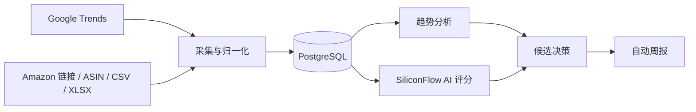

# TrendPilot 亚马逊选品情报工作台

TrendPilot 是供内部选品团队使用的 Web 工作台，覆盖数据采集、趋势分析、AI
评分和决策周报四个阶段。当前版本已经部署到阿里云 ECS，并使用 PostgreSQL
持久化数据。

> 状态快照：2026-09-28。当前为内部试用版，不建议在没有 HTTPS、访问控制和
> 监控告警的情况下开放给不受信任的公网用户。

## 当前状态

| 项目          | 状态           | 说明                                          |
| ------------- | -------------- | --------------------------------------------- |
| Web 应用      | 已上线         | Next.js 16，Docker 容器运行于 ECS             |
| 数据库        | 已上线         | PostgreSQL 16，数据库端口不对公网暴露         |
| 候选产品      | 已入库         | 公开趋势、ASIN 候选与已复核商品分口径管理   |
| Amazon 候选  | 已上线         | 粘贴链接或 ASIN，不自动抓取受限字段         |
| Google Trends | 已自动化       | 每天 09:00 采集美国站公开趋势                 |
| CSV/XLSX 导入 | 已保留         | 支持 Octoparse、卖家精灵和自定义表格       |
| AI 评分       | 已上线         | SiliconFlow 已配置，支持五维评分与卖点提炼    |
| 用户登录      | 已上线         | 环境管理员 + 数据库内部成员，8 小时会话       |
| 自动周报      | 已上线         | 支持生成、保存与下载周报                      |
| 数据备份      | 待复核         | 每天 03:00，保留 14 天；恢复演练尚待线上执行  |
| 域名与 HTTPS  | 未完成         | 当前仅 HTTP/IP 访问                           |

详细状态与风险见 [项目状态](docs/PROJECT_STATUS.md)。

## 使用路径

1. 登录系统，在“数据采集”查看渠道和最近运行结果。
2. 粘贴 Amazon 链接/ASIN，或导入 Octoparse、卖家精灵 CSV/XLSX。
3. 在“趋势分析”筛选升温、回落及异常产品。
4. 在“AI 评分”运行五维评分，复核痛点和卖点。
5. 在“决策产出”生成并下载周报。

## 架构


```mermaid
flowchart LR
  A[Google Trends] --> C[采集与归一化]
  B[Amazon 链接 / ASIN / CSV / XLSX] --> C
  C --> D[(PostgreSQL)]
  D --> E[趋势分析]
  D --> F[SiliconFlow AI 评分]
  E --> G[候选决策]
  F --> G
  G --> H[自动周报]
```

## 本地运行

要求 Node.js 22.13+ 和可访问的 PostgreSQL。

```bash
npm ci
npm run dev
```

生产构建：

```bash
npm run build
```

生产数据库以 `deploy/postgres.sql` 为新环境完整基线，以 `deploy/migrations/`
为已有环境的增量升级入口。`db/schema.ts` 和 `drizzle/` 是早期 SQLite 历史记录，
不得用于生产 PostgreSQL 初始化。

所需环境变量、部署和恢复步骤见 [运维手册](docs/OPERATIONS.md)。

## 文档导航

- [项目状态与路线图](docs/PROJECT_STATUS.md)
- [运维与部署手册](docs/OPERATIONS.md)
- [商品数据接入规范](docs/DATA_INGESTION.md)
- [交接与验收清单](docs/HANDOVER_CHECKLIST.md)
- [0.19.0 发布基线](docs/RELEASE_0.19.0.md)
- [0.20.0 决策口径升级](docs/RELEASE_0.20.0.md)

## 安全原则

- 不向仓库提交 `.env`、账号密码、API Key、数据库连接串或 SSH 私钥。
- 自动化接口必须携带 `AUTOMATION_SECRET`。
- 数据库只加入 Docker 内部网络，不映射公网端口。
- 没有域名和 HTTPS 前，仅限受信任的内部人员试用。
